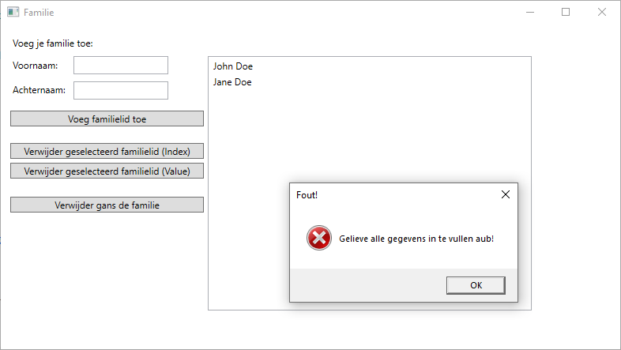
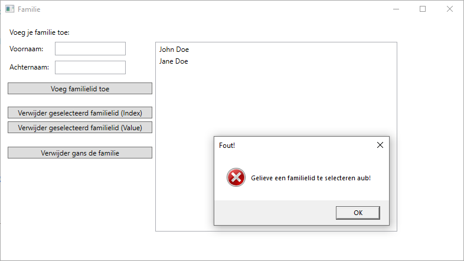

# Familie met Lists
In deze oefening is het de bedoeling dat we tekst gaan opslaan in een variabele van het type `List<string>`. We kunnen aan de hand van deze oefening ook items verwijderen uit een List.  We houden de gebruiker op de hoogte bij foutieve handelingen.

## Werking
### Voeg familielid toe
De gebruiker geeft een voor- en achternaam in door middel van twee textboxen. Deze twee namen worden gecombineerd tot één string.
Deze string wordt opgeslaan in een variabele van het type `List<string>`. De gebruiker kan zoveel namen ingeven als hij/zij zelf wenst.

### Verwijder geselecteerd familielid (Index)
Wanneer men op deze knop drukt zal men het geselecteerd familielid verwijderen uit de listbox en uit de `List<string>`. 
Het familielid wordt uit de List verwijderd aan de hand van de **index**!

### Verwijder geselecteerd familielid (Value)
Wanneer men op deze knop drukt zal men het geselecteerd familielid verwijderen uit de listbox en uit de `List<string>`. 
Het familielid wordt uit de List verwijderd aan de hand van de **waarde** van het geselecteerde item!

### Verwijder gans de familie
Wanneer men op deze knop drukt zal de listbox leeggemaakt worden en zal de variabele van het type `List<string>` opnieuw geinitialiseerd wroden.

## Gebruikersfouten
### Geen namen ingegeven
Indien de gebruiker geen voor- **of** achternaam heeft ingegeven moet hij hiervan op de hoogte gebracht worden door een `MessageBox` met een passende boodschap.
Voorbeeld:

### Geen naam geselecteerd voor verwijderen
Indien die gebruiker op één van de twee knoppen klikt om een familielid te verwijderen moet er een melding gemaakt worden indien er geen familielid werd geselecteerd.
Voorbeeld:

